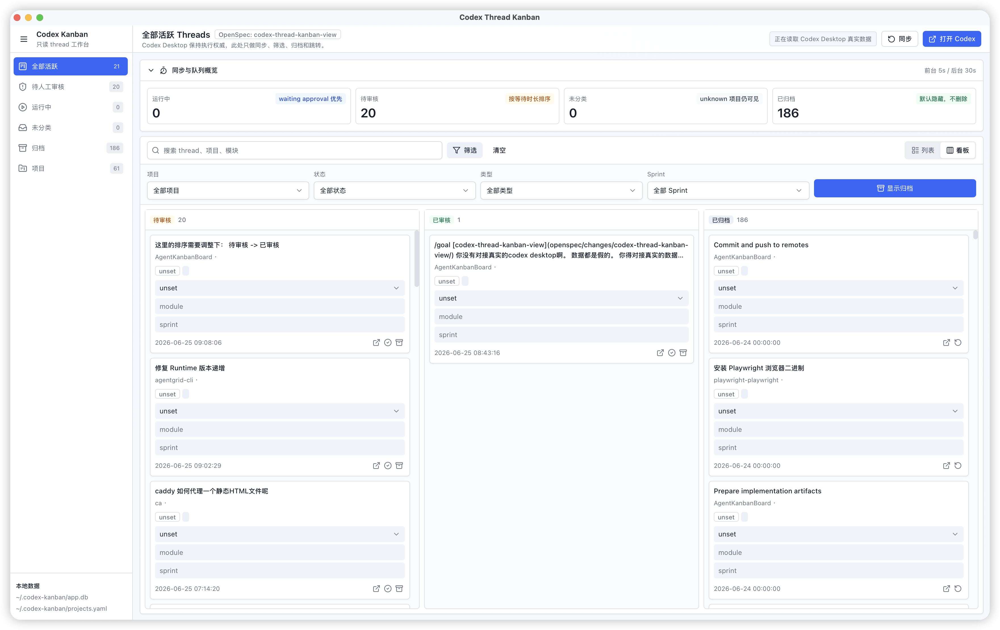

# Codex Thread Kanban

[English](README.md) | 简体中文

Codex Thread Kanban 是一个面向 Codex Desktop 用户的本地桌面看板。它把分散在不同项目里的 Codex threads 汇总到一个只读工作台中，帮助你快速看到哪些任务正在运行、哪些任务需要人工审核、哪些历史会话可以归档。

这个项目的核心价值不是替代 Codex Desktop，而是补上“多线程并行工作时的注意力管理层”：Codex Desktop 继续负责创建、执行、审批和查看 thread 详情；Codex Thread Kanban 负责同步、分组、筛选、标记、归档和跳转。

本项目以 [MIT License](LICENSE) 开源。



## 主要功能

- **统一看板视图**：汇总本机 Codex Desktop threads，提供全部活跃、待人工审核、运行中、未分类、归档和项目视图。
- **可靠的只读同步**：读取 Codex Desktop 本地 thread 快照与名称索引，跟随 Codex 中的 thread 名称，并自动排除 subagent thread；同步不会调用执行、审批、删除等写操作。
- **本地状态管理**：将 thread 映射为 `untriaged`、`running`、`review_pending`、`reviewed`、`suspended`、`archived`，并在本地保留人工状态。
- **待审核队列**：把结束运行或等待处理的 thread 聚合到待人工审核入口，适合集中检查 Codex 的输出。
- **归档与恢复**：归档默认从活跃视图隐藏，但不删除本地数据，也不删除 Codex Desktop 里的 thread。
- **项目归类**：根据 cwd、origin URL、路径别名等信息识别 thread 所属项目，无法识别时进入 Unknown。
- **固定字段标注**：支持为 thread 维护 `task_type`、`module`、`sprint` 和 notes，便于后续筛选和复盘。
- **列表 / 看板双布局**：列表适合快速扫描和批量处理，看板适合按状态跟踪队列。
- **独立 To Do List**：提供持久化的树形任务列表，支持状态、截止日期、Markdown 扩展信息、同级拖拽排序以及快捷插入任务。
- **Thread / Task 双向关联**：一个 thread 可以关联一个任务，一个任务可以关联多个 threads；关联支持迁移、撤销和双向定位。
- **高效任务组织**：任务树按完成度分组，默认每页展示 200 条；关联 thread 可从任务列表直接在 Codex Desktop 中打开。
- **自适应窄屏布局**：To Do List 根据可用宽度依次压缩或隐藏操作与日期列，优先保留任务和关联 thread 信息。
- **快捷操作**：支持 `Cmd+1` / `Cmd+2` 切换看板与 To Do List、禅模式隐藏导航，并可从 thread 行打开 Codex、打开 VS Code 或复制 session id。
- **评论与大列表性能**：thread 评论按需加载，列表使用虚拟化渲染，保持周期刷新链路轻量。

## 适合谁用

如果你经常同时开多个 Codex Desktop 任务，这个工具可以帮助你回答几个问题：

- 现在还有哪些 thread 在跑？
- 哪些 thread 已经结束，需要我回 Codex Desktop 审核结果？
- 某个项目最近有哪些 Codex 工作？
- 哪些旧 thread 已经可以从活跃视图里收起来？
- 我能不能用 module、sprint、任务类型把 Codex 工作粗略组织起来？
- 一个产品任务关联了哪些 Codex threads，当前整体进度如何？

## 数据边界

Codex Thread Kanban 是本地优先、只读同步的 sidecar 应用。

- Codex 数据源：默认只读 `~/.codex/state_5.sqlite` 和同目录的 thread 名称索引。
- 看板本地库：默认写入 `~/.codex-kanban/app.db`。
- 应用只保存自己的看板状态、人工字段、归档状态、项目识别结果、To Do 任务和 Thread / Task 关联。
- 应用不会启动 thread、恢复 thread、审批请求、执行 shell command 或删除 Codex 数据。
- 打开 Codex 只通过 `codex://` deep link 跳转，后续执行仍由 Codex Desktop 接管。

## 技术栈

- 桌面壳：Tauri 2
- 后端：Rust、rusqlite、SQLite
- 前端：React 18、TypeScript、Vite
- UI：Tailwind CSS、Radix UI、lucide-react
- 测试：Vitest、Rust unit tests
- 构建产物：macOS `.dmg`

## 本地开发

前置依赖：

- Node.js 22 或兼容版本
- npm
- Rust stable
- macOS 上构建 dmg 需要系统自带 `hdiutil`

安装前端依赖：

```bash
npm --prefix src-ui ci
```

只调试前端界面时，可以启动 Vite：

```bash
npm --prefix src-ui run dev
```

运行完整桌面应用时，使用 Tauri 开发模式。该命令会根据 Tauri 配置自动启动前端开发服务：

```bash
cd src-ui
npm exec tauri dev
```

## 测试

在仓库根目录执行：

```bash
make test
```

该命令会运行：

- `npm --prefix src-ui run test`
- `cargo test --manifest-path src-tauri/Cargo.toml`

## 本地构建

在仓库根目录执行：

```bash
make build
```

该命令会安装前端依赖、构建 Tauri 应用，并生成 macOS dmg 安装包。生成路径：

```text
src-tauri/target/release/bundle/dmg/
```

也可以直接执行：

```bash
make build-dmg
```

## GitHub 自动构建

仓库包含 GitHub Actions workflow：

```text
.github/workflows/build-artifacts.yml
```

触发方式：

- 推送到 `main`
- 创建或更新 Pull Request
- 在 GitHub Actions 页面手动执行 `Build Artifacts`

workflow 会在 macOS runner 上运行测试，构建 dmg，并上传名为 `codex-thread-kanban-dmg` 的构建制品。

## 项目结构

```text
.
├── src-ui/        # React + TypeScript 前端
├── src-tauri/     # Tauri / Rust 后端、本地 SQLite、deep link、同步逻辑
├── openspec/      # 功能设计与变更规格
├── docs/images/   # README 和文档截图
├── Makefile       # 测试与 dmg 构建入口
├── LICENSE        # MIT License
├── README.md      # 英文文档
└── README_zh.md   # 简体中文文档
```

## 许可证

Copyright (c) 2026 gaoyunchuan

本项目基于 [MIT License](LICENSE) 开源。你可以自由使用、复制、修改、合并、发布、分发、再许可或销售本软件的副本，但必须在软件副本或主要部分中保留原始版权声明和许可声明。

## 当前状态

这是一个持续迭代中的本地桌面工具，已经具备真实 Codex thread 读取、看板展示、筛选、字段编辑、审核与挂起、归档恢复、Codex 跳转、持久化 To Do List、Thread / Task 双向关联和窄屏自适应能力。后续适合继续完善项目配置编辑、状态同步适配和打包发布。
